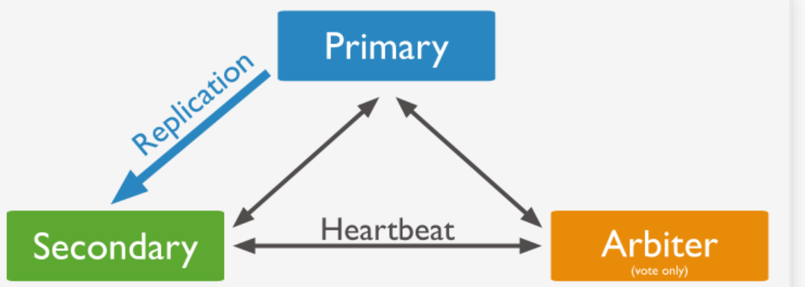
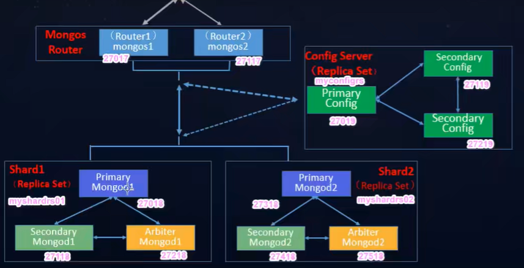

# 1. 入门

## 1.1 安装和启动

启动mongod

```shell
mongod.exe --config mongod.cfg
```

mongod.cfg是自定义的配置文件, 格式为yml

```yaml
# 常见的配置包括日志存储位置, 文件的存储位置, 端口, 是否开启安全认证
systemLog:
  destination: file
  path: "D:\\mongodb-win32-x86_64-windows-6.0.4\\log\\mongod.log" 
net:
  port: 27017
storage:
  dbPath: "D:\\mongodb-win32-x86_64-windows-6.0.4\\data"
security:
  authorization: false
```

## 1.2 数据库结构

mongodb的数据模式为

```
database->collection->document->field
```

安装好后默认包含三个数据库, 这三个数据库被系统使用

```shell
admin: 用户和权限信息
local: 这个数据库里的collection在副本集中永远不会被复制副本
config: 配置信息
```

## 1.3 重要概念

### 1.3.1 索引

索引: mongodb为了提高查询速度会为特定的field创建索引, 索引采用b/b+树结构

### 1.3.2 副本集

副本集(replica set): mongodb的一个副本集中会存在主节点(选举得出)和从节点和仲裁节点,   从节点负责读服务, 主节点负责写服务, 同一份数据会复制到在集群的所有主从节点上,  当主节点挂掉时, 仲裁节点会选出新的主节点.



 搭建副本集的每个节点需要在配置文件中指明节点所在副本集名称

```yaml
replication:
  replSetname: myset0 # 副本集名称
```

使用cli初始化和管理副本集的常用命令

```js
//查看当前节点的副本集信息和配置
rs.status()
rs.config()

rs.initiate() //在副本集的主节点上初始化副本集
rs.add() //添加从节点
rs.addArb() //添加仲裁节点
```

### 1.3.3 分片集群

分片集群(shard cluster), 如果一个副本集中存储的数据过多, 会水平扩展到多个副本集中, 路由副本集转发请求后, 请求先经过一个配置服务器的副本集, 找到要查询的文档所在的副本集.

存储数据的副本集和配置服务器的副本集, 路由服务器副本集合起来就是一个分片集群

路由节点启动程序是`mongos.exe`, 其他节点是 `mongod.exe`



存储数据的副本集和配置服务器副本集的配置文件需要指明在分片集群中的角色

```yaml
sharding:
  clusterRole: shardsvr # 表示改节点是一个存储数据的副本集中的一个节点, 如果时配置服务器就设置为configsvr
```


配置路由实例的配置副本集

```
sharding:
 configDB: 副本集名称/副本集的实例host列表
```

配置路由实例的分片副本集

```
sh.addShard(副本集名称/副本集的实例host列表) //添加分片
sh.status() //查看当前节点的分片信息
sh.shardCollection(数据库名称.集合名称, 分片策略)// 将集集合分片
```

### 1.3.4 访问控制

mongodb采用RBAC权限模型, 内置一些角色, 如read, readwrite, userAdmin, root

```
use admin //需要在admin数据库中使用以下命令
db.createUser(user: "myroot", pwd: "123456", roles: ["root"]) //创建用户
```

给数据库添加访问控制(需登录且有权限才可以访问)

```yaml
security:
  authorization: enabled
```

用户登录

```js
db.auth("user", "password")
```

# 2. CRUD shell接口

## 2.1 查询命令

**数据库相关**

```shell
use <dbs-name> //使用特定数据库
show dbs //显示所有数据库
db  //显示当前数据库
db.dropDatabase() //删除数据库
```

**集合相关**

```shell
db.createCollection(<c_name>)
db.<c_name>.drop() //删除集合
```

**文档插入**

```shell
db.<c_name>.insert/insertMany(
  <json格式的document(的列表)>,
  {
        writeConcern: <document>
	orderd: <true/false>
  }
)
```

插入的数据默认为double类型, 可以使用 `NumberInt()`转化

插入当前日期使用 `new Date()`

没有 `_id`属性时会自动生成

**文档查询, 更新, 删除(参数格式省略)**

```shell
db.<c_name>.find/findOne().skip(<跳过前几个结果>).limit(<选择多少个结果>).sort()
db.<c_name>.updata()
db.<c_name>.remove()
db.<c_name>.count()
```

## 2.2 特殊的查询条件

正则表达式查询

```shell
name: /^John/i
```

比较, 包含

```shell
age: {"$gt": 18}
age: {"$in": [10, 11]}
```

布尔表达式

```shell
age: {"$and": [{"$gt": 18}, {"$lt": 60}]
```

# 3. Spring data整合
