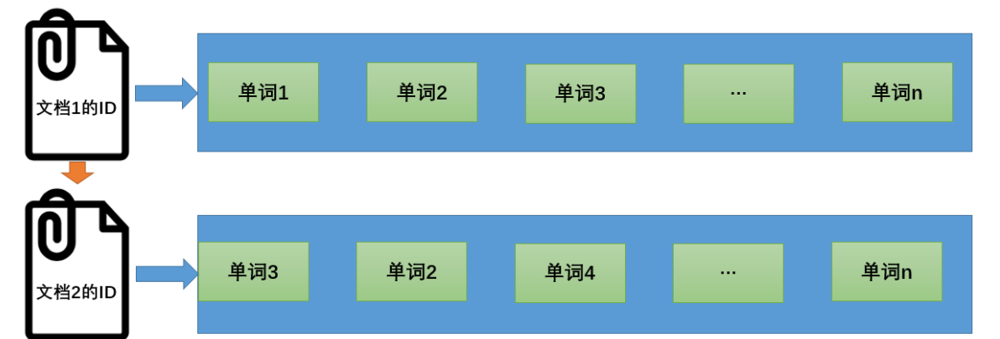
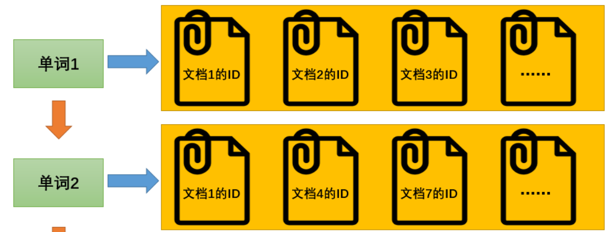

# 1. 入门

## 1.1 搜索引擎原理-倒排索引

正排索引: 当用户查询为一个关键词时，搜索引擎会扫描索引库中的所有文档，找出所有包含关键词的文档, 这样遍历的索引结构效率低下.



倒排索引是信息检索中一个重要的技术



倒排索引可以包含更多信息, 如关键字在文中出现次数, 频率, 位置


## 1.2 ES中的重要概念

Index&Document&Filed: 一个索引(Index)对应多个文档(Document), 一个Document对应多个Filed

分片(Shards): 当索引过大使得单个节点无法存储时, 需要将一个索引分为多个分片放到不同节点上, 分片对用户透明, 由ES内部自己实现

复制(Replicas): 将一个分片及其副本分别存放到集群中不同节点中, 避免单节点故障导致服务不可用, master节点负责将分片及其副本分配到不同节点上

## 1.3 RestFul风格的CRUD接口

索引相关CRUD

```
创建索引
[put] http://host/{indexName}
获取索引信息
[get] http://host/{indexName}
删除索引
[delete] http://host/{indexName}
获取所有索引信息
[get] http://host/_cat/indices
```

设置索引的**映射结构**

```
[put] http://host/{indexName}/_mapping
```

```json
{
  "properties":{
    "description": {
      "index": true,
      "type": "text"
    },
    "name": {
      "index": true,
      "type": "keyword"
    }
  }
}

```

text可被分词, keyword不可被分词

文档相关CRUD

```
添加文档, 请求体为要添加的文档的JSON
[post] http://host/{indexName}/_doc/{specifiedId?}
获取文档
[get] http://host/{indexName}/_doc/{id}
获取所有文档, 请求体为空
[get] http://host/{indexName}/_search
全量更新文档, 请求体为更新后的文档的JSON
[put] http://host/{indexName}/_doc/{id}
更新文档的局部, 请求体JSON结构略
[post] http://host/{indexName}/_update/{id}
删除文档
[delete] http://host/{indexName}/_doc/{id}
```

查询

```
[get] http://host/{indexName}/_search
```

在请求体中使用JSON表达查询条件

示例一: 查询种类为华为的, 并且根据价格降序排序后的前两个手机的手机名称和价格:

```json
{
  "query": {
    "match": {
        "catagory": "华为"
    }
  },
  "from": 0,
  "size": 2,
  "_source": ["title", "price"],
  "sort": {
    "price": {
        "order": "desc"
    }
  }
}
```

示例二

```json
{
  "query": {
    "bool": {
        "should": [
          {"match": {"catagory": "小米"}},
          {"match": {"catagory": "华为"}}
        ],
        "filter":{
          "range":{
            "price":{
              "lt": 5000
            }
          }
        }
    }
  }
}
```

**注意** "match" 是分词然后匹配, "match_phrase"是直接匹配

示例三-聚合查询

```json
{
  "agg":{
    "自定义的名字": {
      "avg":{
        "field": "price"
      }
    }
  }
}
```

## 1.4 Java客户端

```
//适用于ES 6.0+
<dependency>
    <groupId>org.elasticsearch.client</groupId>
    <artifactId>elasticsearch-rest-high-level-client</artifactId>
    <version>6.2.4</version>
</dependency>
```

创建和关闭客户端

```
RestHighLevelClient client = new RestHighLevelClient(
        RestClient.builder(//ES集群
                new HttpHost("localhost", 9200, "http"),
                new HttpHost("localhost", 9201, "http")));
client.close();
```

其他接口参考: [ES-Java-API文档](https://www.elastic.co/guide/en/elasticsearch/client/java-rest/current/java-rest-high-supported-apis.html)

注意: 一般不直接使用ES提供的Java-API, 而使用Spring Data Elasticsearch

## 1.5 集群配置

**`elasticsearch.yml`** 为ES的配置文件

```yml
# ================= Elasticsearch   configuration =================
 # 集群名称
cluster.name: elasticsearch
#最大集群节点数
node.max_local_storage_nodes: 3
# 集群初始主节点名称
cluster.initial_master_nodes: ["No.1"]
#es7.x+ 集群节点发现
discovery.seed_hosts: ["localhost:9700","localhost:9800","localhost:9900"]
 # 节点名称
node.name: No.1
#是不是有资格成为主节点
node.master: true
#是否存储数据
node.data: true
# 数据和日志存储位置
path.data: /opt/data
path.logs: /opt/logs
# 允许访问的主机
network.host: 0.0.0.0  
# 对客户端暴露的端口
http.port: 9200
# 集群内部节点之间通信端口
transport.tcp.port: 9700
```

# 2. Spring Data ES

```xml
        <dependency>
            <groupId>org.springframework.boot</groupId>
            <artifactId>spring-boot-starter-data-elasticsearch</artifactId>
        </dependency>
```

## 2.1 创建文档类

使用@Document表明这是一个文档对应的实体类, @Id, @Field对属性的映射结构进行说明

```java
@Data
//indexName = pms 索引下的文档对应的类
//只有一个分片, 不保存副本
@Document(indexName = "pms", shards = 1,replicas = 0)
public class EsProduct implements Serializable {
    private static final long serialVersionUID = -1L;
    @Id//文档的主键
    private Long id;
    // @field.index 表明是否被索引, 默认true
    @Field(type = FieldType.Keyword, index = true)
    private String productSn;
    private Long brandId;
    @Field(type = FieldType.Keyword)
    private String brandName;

    @Field(analyzer = "ik_max_word",type = FieldType.Text)
    private String name;
    // FieldType.Nested 相对于Json的内嵌
    @Field(type =FieldType.Nested)
    private List<EsProductAttributeValue> attrValueList;
    //...
}
```

分词器分词方式(es需要ik分词插件)

* ik_max_word：会对文本做最细力度的拆分
* ik_smart：会对文本做最粗粒度的拆分

## 2.2 使用ElasticsearchRepository

Spring data 中 操作ES有两种方式, 一种继承ElasticsearchRepository接口, 另一种使用ElasticsearchRestTemplate, 这里介绍使用ElasticsearchRepository的方式

继承ElasticsearchRepository接口后的这个接口会被框架自动实现和注入

```java
//继承ElasticsearchRepository<文档类型, 主键类型>, 该接口由Spring data创建实现类并注册为bean
//可以提供一些简单的查询, 也可以自定义一些方法
public interface EsProductRepository extends ElasticsearchRepository<EsProduct, Long> {
    //Spring data 会方法名  findByXXXAndYYY 去实现对应的查询, 也可以使用@Query自定义查询语句
    Page<EsProduct> findByNameOrSubTitleOrKeywords(String name, String subTitle, String keywords, Pageable page);
}

```

通过方法名推断的查询条件的返回类型可以为:


## 2.3 配置

在配置类中注册RestHighLevelClient, 并开启ESRepository的自动实现接口功能

```java
@Configuration
@EnableElasticsearchRepositories(basePackages = "xyz.mall.nosql.es")
public class SpringDataESConfig extends AbstractElasticsearchConfiguration {
    @Value("${es.hosts}")
    private String[] hosts;
    @Bean
    @Override
    //低版本Spring data es配置RestHighLevelClient, 配置完成后自动会被Repository使用
    public RestHighLevelClient elasticsearchClient() {
        ClientConfiguration configuration = ClientConfiguration.builder()
                .connectedTo(hosts)
                .withConnectTimeout(Duration.ofSeconds(5))
                //.withSocketTimeout(Duration.ofSeconds(3))
                //.useSsl()
                //.withDefaultHeaders(defaultHeaders)
                //.withBasicAuth(username, password)
                // ... other options
                .build();
        RestHighLevelClient client = RestClients.create(configuration).rest();
        return client;
    }
}
```

多个es服务器的集群使用逗号连接

```yaml
# Elasticsearch Cluster配置
es:
  hosts: localhost:9200, localhost:9201
```

## 2.4 调用repository访问es

删除文档

```java
    @Override
    public void delete(List<Long> ids) {
        for (Long id : ids) {
            repository.deleteById(id);
        }
    }
```

全文搜索文档

```java
    @Override
    public Page<EsProduct> search(String keyword, Integer pageNum, Integer pageSize) {
        //Spring data支持分页查询, 在查询时带上Pageable(分页参数)即可
        return repository.findByNameOrSubTitleOrKeywords(keyword, keyword, keyword, PageRequest.of(pageNum, pageSize));
    }
```
